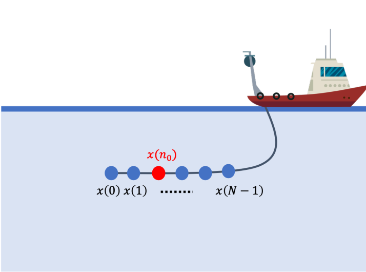

  [![Contributors][contributors-shield]][contributors-url] [![Forks][forks-shield]][forks-url] [![Stargazers][stars-shield]][stars-url] [![Issues][issues-shield]][issues-url] [![MIT License][license-shield]][license-url] [![LinkedIn][linkedin-shield]][linkedin-url]

<!-- PROJECT LOGO -->
<br />

<p align="center">
  <a href="https://github.com/vineeths96/Interpolation-of-faulty-sensor">
    
  </a>
  <h3 align="center">Interpolation of a faulty sensor</h3>
  <p align="center">
    Interpolation of a faulty sensor data sample
    <br />
    <a href=https://github.com/vineeths96/Interpolation-of-faulty-sensor><strong>Explore the repository»</strong></a>
    <br />
    <br />
    <a href=https://github.com/vineeths96/Interpolation-of-faulty-sensor/blob/master/Problem%20statement.pdf>View Problem Statement</a>
    <a href=https://github.com/vineeths96/Interpolation-of-faulty-sensor/blob/master/results/report.pdf>View Report</a>
  </p>


</p>

> tags : interpolation, wiener, kalman, lmmse, estimation, missing data


<!-- ABOUT THE PROJECT -->
## About The Project

This project deals with developing a Wiener (LMMSE) filter and Kalman filter for interpolation of a faulty sensor in a uniform sensor array and implementing and evaluating the performance of the estimators that we have derived. We derive and implement the Wiener filter interpolator (LMMSE) using Wiener-Hopf equations and Kalman filter interpolator, and evaluate their performance.

### Built With
This project was built with 

* python v3.7
* The list of libraries used for developing this project is available at [requirements.txt](requirements.txt).


<!-- GETTING STARTED -->

## Getting Started

Clone the repository into a local machine using

```shell
git clone https://github.com/vineeths96/Interpolation-of-faulty-sensor
```

### Prerequisites

Please install required libraries by running the following command (preferably within a virtual environment).

```shell
pip install -r requirements.txt
```


### Instructions to run

The `wiener_plots.py` acts as an interface to the Wiener filter implementations in `wiener_interpolator.py`. The `kalman_plots.py` acts as an interface to the Kalman filter implementations in `kalman_filter.py`.  The `comparision.py` compares the performance of Kalman filter predictor to that of a causal Wiener predictor.

The respective program can be executed by

```shell
python <file_name>.py
```


<!-- LICENSE -->

## License

Distributed under the MIT License. See `LICENSE` for more information.


<!-- CONTACT -->
## Contact

Vineeth S - vs96codes@gmail.com

Project Link: [https://github.com/vineeths96/Interpolation-of-faulty-sensor](https://github.com/vineeths96/Interpolation-of-faulty-sensor)


<!-- MARKDOWN LINKS & IMAGES -->
<!-- https://www.markdownguide.org/basic-syntax/#reference-style-links -->

[contributors-shield]: https://img.shields.io/github/contributors/vineeths96/Interpolation-of-faulty-sensor.svg?style=flat-square
[contributors-url]: https://github.com/vineeths96/Interpolation-of-faulty-sensor/graphs/contributors
[forks-shield]: https://img.shields.io/github/forks/vineeths96/Interpolation-of-faulty-sensor.svg?style=flat-square
[forks-url]: https://github.com/vineeths96/Interpolation-of-faulty-sensor/network/members
[stars-shield]: https://img.shields.io/github/stars/vineeths96/Interpolation-of-faulty-sensor.svg?style=flat-square
[stars-url]: https://github.com/vineeths96/Interpolation-of-faulty-sensor/stargazers
[issues-shield]: https://img.shields.io/github/issues/vineeths96/Interpolation-of-faulty-sensor.svg?style=flat-square
[issues-url]: https://github.com/vineeths96/Interpolation-of-faulty-sensor/issues
[license-shield]: https://img.shields.io/badge/License-MIT-yellow.svg
[license-url]: https://github.com/vineeths96/Interpolation-of-faulty-sensor/blob/master/LICENSE
[linkedin-shield]: https://img.shields.io/badge/-LinkedIn-black.svg?style=flat-square&logo=linkedin&colorB=555
[linkedin-url]: https://linkedin.com/in/vineeths

